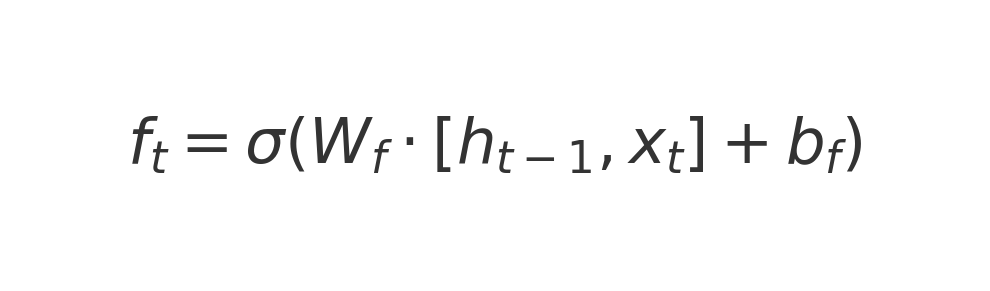
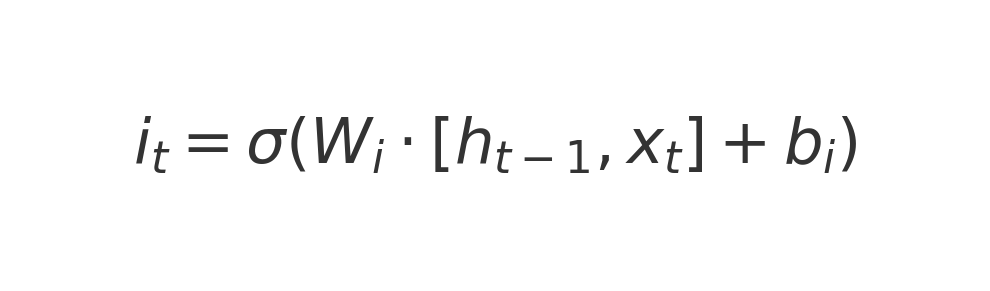
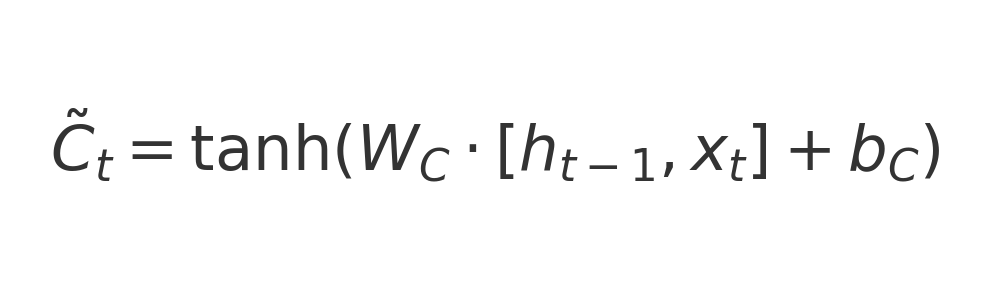
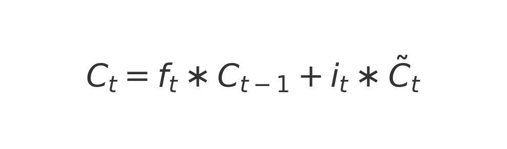
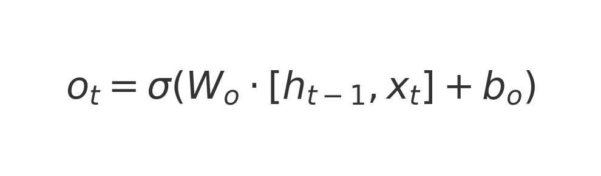
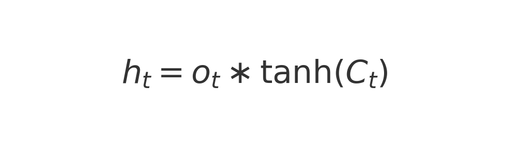
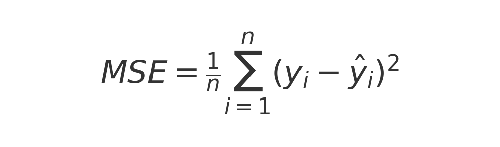

# LSTM Stock Prediction

## Why Use LSTM for Stock Prediction?

Long Short-Term Memory (LSTM) networks are a type of recurrent neural network (RNN) that excel at capturing long-range dependencies in sequential data. Unlike standard RNNs, which suffer from vanishing gradients, LSTMs have a unique gating mechanism that allows them to retain important information over extended periods. This makes them ideal for time-series forecasting, such as stock price prediction, where past trends influence future movements.

## How LSTM is Used in This Project

This project utilizes an LSTM model to predict stock prices based on historical data. The key steps include:

1. **Data Preprocessing**: Stock price data is collected and normalized using MinMax scaling to improve training efficiency.
2. **Sequence Creation**: The data is structured into input sequences and corresponding target values for supervised learning.
3. **Model Training**: The LSTM network is trained using Mean Squared Error (MSE) loss and optimized with Adam optimizer.
4. **Prediction**: Once trained, the model can forecast future stock prices.

## Mathematical Formulations

### 1. LSTM Cell Equations

#### Forget Gate:

Determines how much of the past information should be forgotten.

#### Input Gate:

\[
i_t = \sigma(W_i \cdot [h_{t-1}, x_t] + b_i)
\]

Controls the amount of new information added to the cell state.

#### Candidate Cell State:

\[
\tilde{C}_t = \tanh(W_C \cdot [h_{t-1}, x_t] + b_C)
\]

Represents new candidate information to be stored.

#### Cell State Update:

\[
C_t = f_t \ast C_{t-1} + i_t \ast \tilde{C}_t
\]

Updates the internal memory of the LSTM cell.

#### Output Gate:

\[
o_t = \sigma(W_o \cdot [h_{t-1}, x_t] + b_o)
\]

Determines how much of the cell state should be output.

#### Hidden State Update:

\[
h_t = o_t \ast \tanh(C_t)
\]

Generates the hidden state passed to the next time step.

### 2. Loss Function: Mean Squared Error (MSE)

The loss function used to train the model is:

\[
MSE = \frac{1}{n} \sum_{i=1}^{n} (y_i - \hat{y}_i)^2
\]

where:

- \( y_i \) is the actual stock price,
- \( \hat{y}_i \) is the predicted stock price.

### 3. Feature Scaling (Normalization)

To normalize stock prices before training:

\[
X' = \frac{X - X_{\text{min}}}{X_{\text{max}} - X_{\text{min}}}
\]

Ensures all values remain in a fixed range (e.g., 0 to 1) for better training stability.

### 4. Moving Average for Trend Smoothing

To smooth out stock price fluctuations:

\[
MA_t = \frac{1}{N} \sum_{i=t-N+1}^{t} P_i
\]

where \( P_i \) is the stock price at time \( i \), and \( N \) is the window size.

## Applications of LSTM in Stock Prediction

- **Short-Term Trading**: Predicts daily or weekly stock movements.
- **Algorithmic Trading**: Integrates with automated trading strategies.
- **Portfolio Management**: Helps in making informed investment decisions.
- **Risk Management**: Identifies potential downturns and mitigates financial risks.

LSTM models provide a powerful approach to analyzing stock market trends. This project leverages LSTM networks alongside sentiment analysis (e.g., news sources like CNN and Barron’s) and technical indicators to enhance prediction accuracy.
